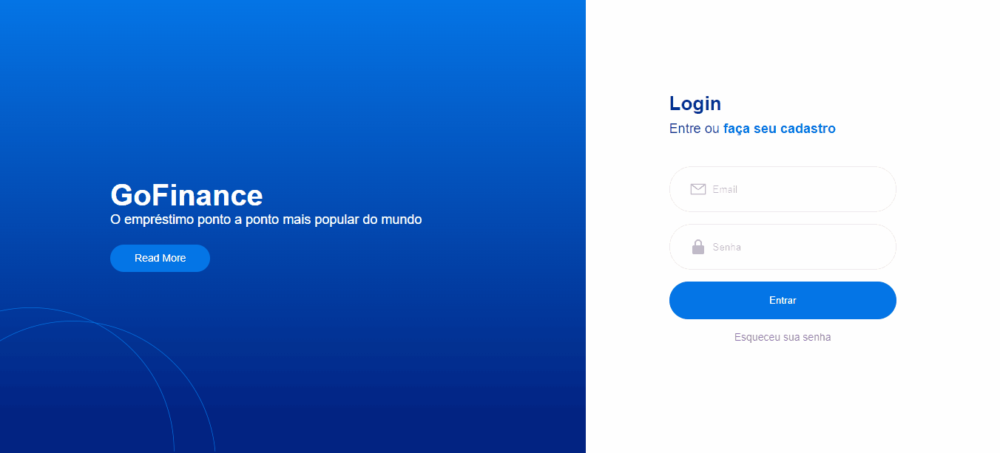

# 💻 Tela de Login/Cadastro

## 📜 Task

Projeto proposto pelo curso de react da Raro Academy, com o objetivo de reproduzir uma tela de login/cadastro o mais fiel possível ao design disponibilizado usando o figma.

## 📝 Foi utilizado

- HTML5
- CSS3
- Responsividade
- Clean Code

## 📺 Demonstração

     

## 👩‍💻 Desenvolvedora front end

<table align="center">
  <tr>
    <td align="center">
      

         
          <b> Karine Pereira </b> 
            
            
      

    </td>

  </tr>
</table>
      
